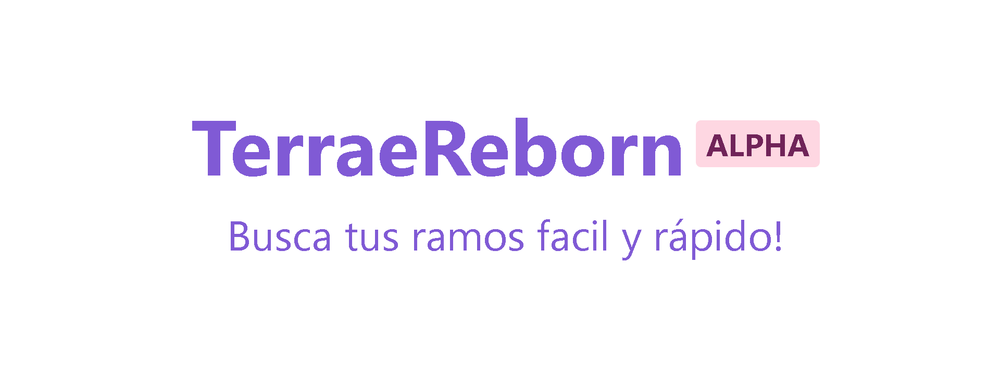
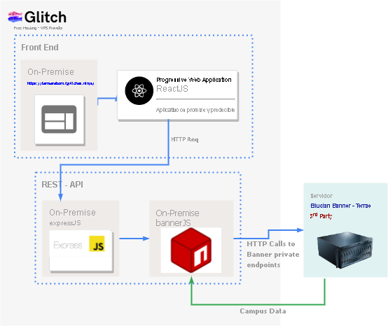

# Terrae-Reborn

PWA para consultar los nrcs de las asignatura en la universidad finis terrae.

Visible en : https://terraereborn.fgvilches.ninja/

## Contenidos
- [Por qué](#por-qué)
- [Como](#como)
- [Changelog](#changelog)
- [Soporte y discusión](#soporte)

## Por qué
La idea de terrae reborn es facilitar el acceso a la informacion sobre los ramos de los alumnos utilizando una interfaz rapida y limpa que logre obtener la información en tiempo real.
## Como
### Diagrama de arquitectura

   
  
   

### Explicacion URL Endpoints
Si necesitas saber como funcionan los endpoints de Banner (el erp de terrae) puedes verlo en la siguiente URL:
https://github.com/schedulemaker/bannerjs/wiki/URL-Endpoints

Pero en resumen se tienen 2 endpoints que requieren que se envíe una ID de sesión y una cookie con la solicitud para poder sacar los datos de banner, pero podemos obtener una cookie para hacer las consultas de la siguiente manera:

Primero realizamos una solicitud GET o POST a <URL base>/StudentRegistrationSsb/ssb/term/search con los siguientes parámetros:

- term: un código de semestre válido (puedes consultar en otra url mencionada en el link de arriba los codigos de todos los semestres).
- Codigo de carrera. (CIT en caso de ingenieria informatica)

Luego de hacer la request con el semestre y el codigo de carrera que necesitamos guardamos los valores del encabezado set-cookie. Y finalmente utilizamos el valor de la cookie cuando necesitemos realizar una solicitud a cualquier endpoint de banner.

Listo!. De esa manera puedes obtener (casi) cualquier dato sin un id.

## Changelog

V.0.1.1
- Se agregó conexion con el historial de versiones de github.
- Se agregó el campo codigo del curso para verificar y contrastar con mallas.
- Se agregó el numero de versión al final del sitio.
- Se cambió la api REST de digitalocean a glitch en el free tier.
- Se cambió la UI de la web de digitalocean a github pages.
---
V.0.0.4
- Se agregó conexión con el historial de versiones de github.
- Se agregó el campo código del curso para verificar y contrastar con mallas.
- Se agregó el numero de versión al final del sitio.
---
V.0.1
- Initial Release
## Soporte y discusión
Si tienes cualquier duda sobre este proyecto no dudes escribirme a fgvilches@icloud.com o en discord a shift#3448
